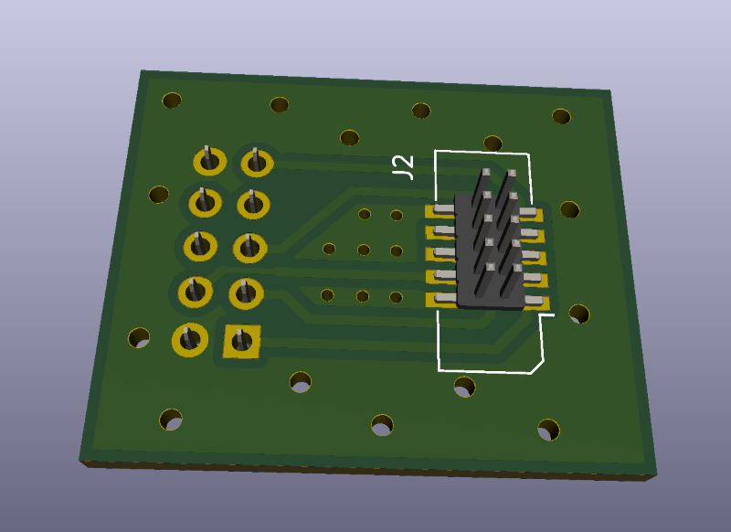
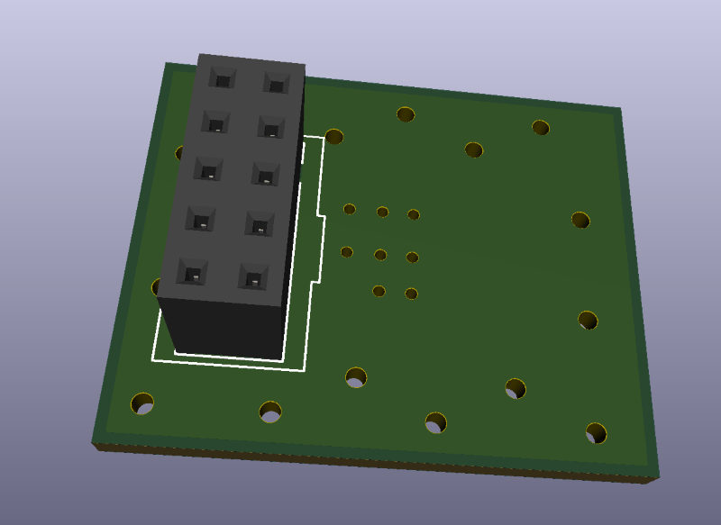

# **AngeliaLite**
## **FPGA JTAG Adapter**

This directory contains schematics and gerber files for the JTAG adapter from the standard 2x5 pins 2.54mm pin grid socket to the miniature BH1.27-10SMD socket used in the AngeliaLite.

The pinout of the both sockets are the same. The sockets are mounted on the opposide sides of the PCB:

## **How to use the adapter**

The usage is straightforward - just plug the adapter into the socket of the Altera USB Byte Blaster (or compatible JTAG cable). And use the flat cable with two IDC1.27-10 sockets to connect adapter and AngeliaLite board.

