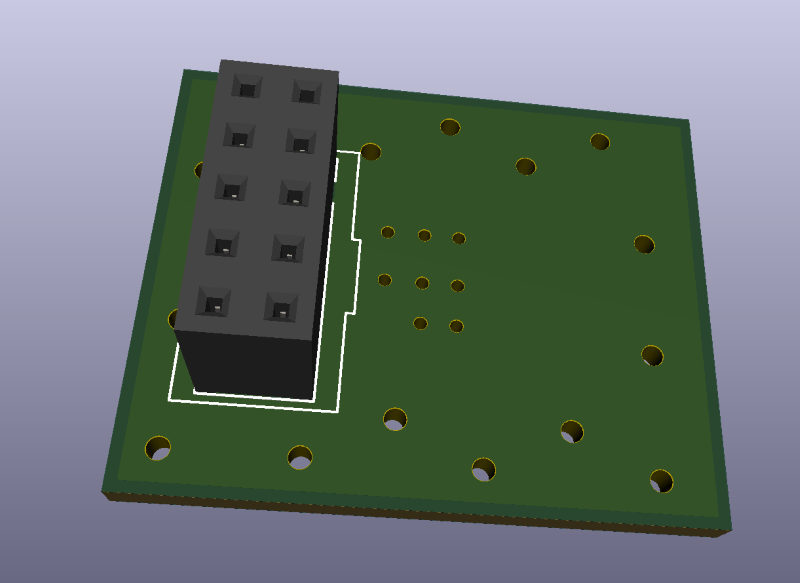

# **AngeliaLite**
## **FPGA JTAG Adapter**

This directory contains schematics and gerber files for the JTAG adapter. It is used to connect the standard 2x5 pins 2.54mm pin grid connector (used in the Altera Byte Blaster or other similar JTAG cables) to the miniature BH1.27-10SMD connector used in the AngeliaLite.

The pinouts of the both connectors are the same. The connectors are mounted on the opposite sides of the PCB:

## **How to use the adapter**

The usage is straightforward - just plug the adapter to the Altera USB Byte Blaster (or compatible JTAG cable). And use the flat cable with two IDC1.27-10 sockets to connect adapter and AngeliaLite board.

