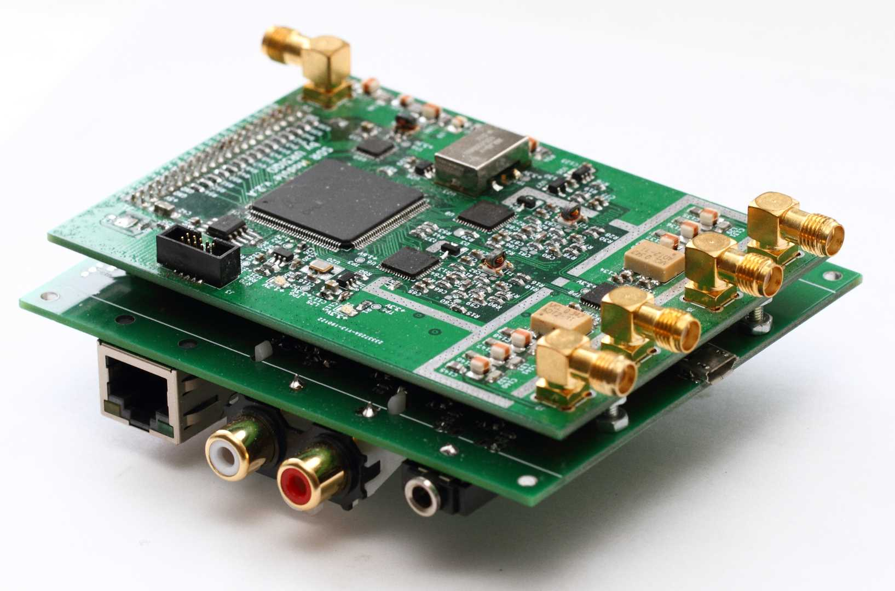

# **AngeliaLite**
**Overview**

A two ADCs HF/50MHz direct sampling SDR transceiver with OpenHPSDR v2 compatible protocol.

Some time ago I designed an SDR module for my other projects. The module has two RX inputs (with DVGA and 14bits ADC) and one TX output (with 14bits DAC). There are also Cyclone 4 FPGA, configuration memory and all necessary components for clocking and power it up. The ADCs are clocked at 77.76MHz and the DAC is clocked at 155.52MHz.

The goal of this project was to build an OpenHPSDR compatible SDR transceiver based on that SDR module. The FPGA firmware is based on the OpenHPSDR Angelia code, the NCO code is from the HermesLite2 project. There were many changes in the code to fit 4 DDCs into the relatively small and low pin count EP4CE22E22 FPGA, some changes were requied because of the different ADC/DAC sample rates.

The second board contains Eternet PHY, standard ALEX, OC, keyer and PTT interfaces, four analog inputs, diagnostic LEDs, switching regulator (so it can be powered from the single 12V supply). There is also STM32F072 MCU on the secons board.

There is no amplifier at the DAC output - just an LPF filter-diplexer.

**There are some limitations:**
* The maximun supported output samplerate is 192kSPS
* There is no audio CODEC on the boards
* The Ethernet connection has 100Mbit/s speed

The SDR operates with the ***SDR Console v3*** and ***Thetis***.
