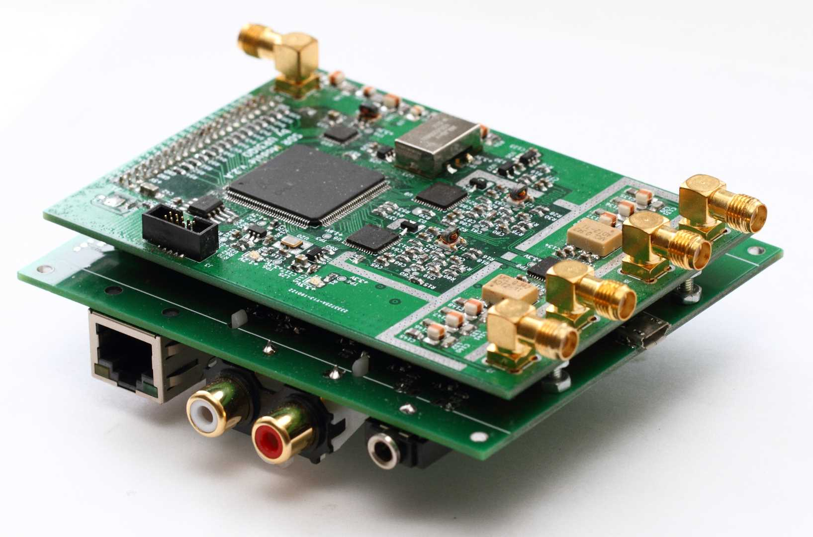
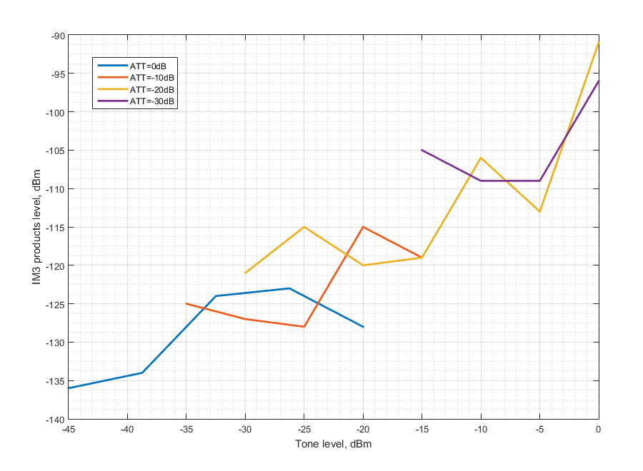

# **AngeliaLite**
**Overview**

A two ADCs HF/50MHz direct sampling SDR transceiver with OpenHPSDR v2 compatible protocol.

Some time ago I designed an SDR module for my other projects. The module has two RX inputs (with DVGA and 14bits ADC) and one TX output (with 14bits DAC). There are also Cyclone 4 FPGA, configuration memory and all necessary components for clocking and power it up. The ADCs are clocked at 77.76MHz and the DAC is clocked at 155.52MHz.

The goal of this project was to build a base for the OpenHPSDR compatible SDR transceiver based on that SDR module. The FPGA firmware is based on the OpenHPSDR Angelia code, the NCO code is from the HermesLite2 project. There were many changes in the code to fit 4 DDCs into the relatively small and low pin count EP4CE22E22 FPGA, some changes were requied because of the different ADC/DAC sample rates.

The second board contains Eternet PHY, standard ALEX, OC, keyer and PTT interfaces, four analog inputs, diagnostic LEDs, switching regulator (so it can be powered from the single 12V supply). There is also STM32F072 MCU on the secons board.

You need to add some RX filtering and TX amplifier with LPFs to get a full featured transceiver.

**There are some limitations:**
* The maximun supported output samplerate is 192kSPS
* There is no audio CODEC on the boards
* The Ethernet connection has 100Mbit/s speed
* The ADC opaerates on the second Nyquist zone on 50MHz band. The board has LPF filter with 65MHz cutoff frequency, so additional selectivity is needed to avoid images reception. It can be as simple as switchable 30MHz LPF and 50MHz bandpass filter.
* There is no TX power amplifier at the DAC output - just an LPF filter-diplexer. So, you will need some amplfication/filtering in the TX path.

The SDR operates with the ***SDR Console v3*** and ***Thetis***.

# **Specifications**
**General**| |
:-|-|
Architecture | *Direct Sampling DDC/DUC Transceiver*  |
Interface | *Ethernet (100Mb/s)*  
TCXO Stability | *±0.5 PPM*  
RX ports | *Two SMA connectors (each ADC has dedicated input)*  
TX ports | *SMA connector* 

**Electrical**|
:-|
13.8v DC @ 0.5A|

**Mechanical** | |
:-|-|
Weight | *100g (approx.)*  
Dimensions (two boards stacked) | *100mm x 85mm x 35mm*

**Receiver**| |
:-|-|
Receiver Architecture | *Direct Sampling / Digital Down Conversion*  
ADC | *Dual 14 bit Phase Synchronous ADCs @ 77.76MSPS. Hardware supports 4 independent receivers assignable to either ADC*  
Frequency Coverage | *1MHz to 35MHz (1st Nyquist zone) and 45MHz to 65MHz (2nd Nyquist zone), reception below 1MHz is possible with some RX parameters degradation*  
Input filtering | *LPF with 65MHz cutoff frequency*  
Attenuator | *0..31dB 1dB step attenuator*  

**Transmitter**| |
:-|-|
Transmitter Architecture | *Digital Up Conversion*  
DAC | *14 bit @ 155.52MSPS*  
RF Output Power | *-3dBm*

**IOs:**|
:-|
RCA PTT in, PTT Out |
3.5mm Jack CW Key |
2.54mm pin headers for ALEX, 7 freely programmable open collector outputs, analog Inputs (4channel + power supply monitoring), two digital inputs |
SMA connector for 10MHz referenve input/output |
SMA connector for 155.52MHz reference output |
RJ45 Ethernet LAN Connector |

# **Measurements**
**MDS/FS level/BDR**

ATT | MDS | FS level | BDR |
---: | ---: | ---: | ---: |
  0dB| -133dBm | -13dBm | 120dB |  
-10dB| -127dBm | -2dBm | 125dB |
-20dB| -117dBm | +9dBm | 126dB |
-30dB| -107dBm | - | - |

**RMDR**

Offset | RMDR | SSB noise
---: | ---: | ---:
1kHz | 111dB | -138dBc/Hz
2kHz | 113dB | -140dBc/Hz
5kHz | 117dB | -144dBc/Hz
10kHz | 121dB | -148dBc/Hz
20kHz | 124dB | -151dBc/Hz

**IMD3**

The usual method of determining IMD3 receiver performance does not give useful data when testing direct sampling receiver (because of IMD products does not follow cubical law). So, the IMD3 performance data presented in graphical form showing IM3 levels depending of the test tones levels for the different attenuator settings.

